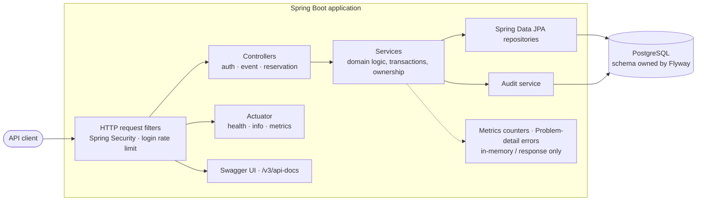
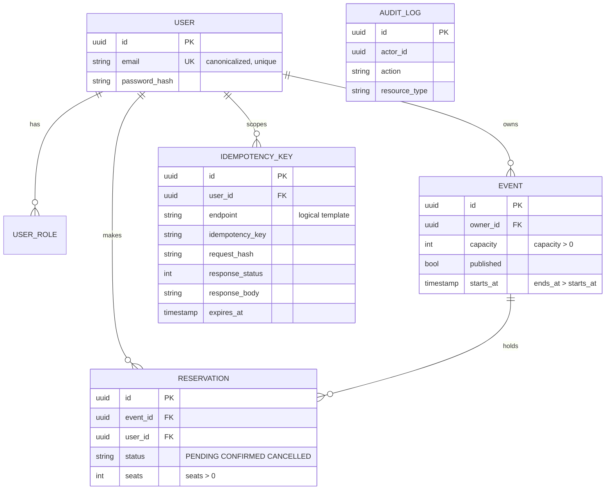
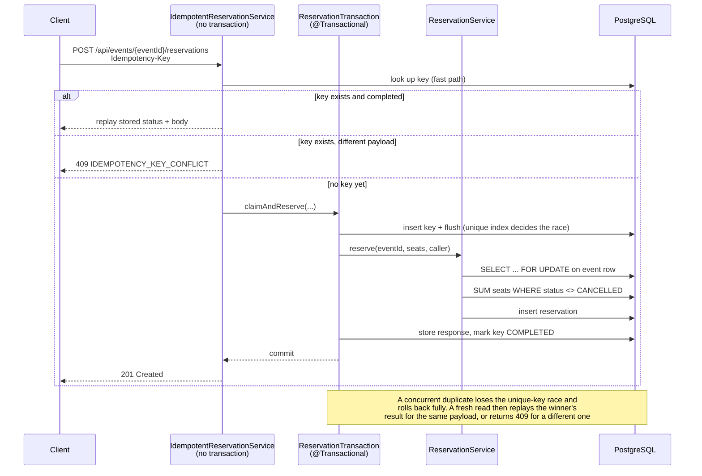

# Architecture

How the system is built and how the critical flows behave. For **why** each choice was made, see
[decisions.md](decisions.md). For authentication, authorization and the complete access-control
matrix, see [security.md](security.md). The generated API reference at `/v3/api-docs` carries the
request and response shapes and is not duplicated here.

## Architectural style

A single Spring Boot deployable, organized as a **feature-oriented layered monolith**. Each business
capability owns a package containing its controller, service, repository and DTOs, and the normal
request path is controller → service → repository → database.

There is no port-and-adapter layer, no separate domain model with mappers, and no interface for a
service with one implementation. Those abstractions pay off when there is a second implementation to
swap in; here they would be indirection for no return
([AD-1](decisions.md#ad-1-feature-oriented-layered-monolith)).

The consequence is a codebase that is deliberately boring to navigate: the interesting engineering
sits in the concurrency and idempotency logic rather than in a framework of our own making.

## System overview

**Every** HTTP entry point passes through the Spring Security filter chain, including Actuator and
the API-reference endpoints — being publicly readable is an authorization decision taken *inside* the
chain, not a bypass of it. Login rate limiting is a separate servlet filter rather than part of that
chain. Controllers validate input and map DTOs; they hold no business logic and no
transactions. Services own domain logic, transaction boundaries and ownership checks. Of the
cross-cutting concerns, only audit persists anything: metrics are in-memory counters and error
handling only shapes the response.

## Package structure

| Package | Responsibility |
|---|---|
| `auth` | Registration, login, refresh, and the auth DTOs |
| `user` | `User` entity, `Role`, repository |
| `event` | Event lifecycle, owner listing, public discovery |
| `reservation` | Reserve, confirm, cancel, and the idempotent orchestration |
| `idempotency` | `IdempotencyKey` entity and repository |
| `security` | Filter chain, JWT issuing and decoding, rate limiting, `CurrentUser` |
| `audit` | Audit entity, repository and service |
| `observability` | `TicketingMetrics`, the counter facade |
| `common/error` | `ErrorCode`, `BusinessException`, the global handler |
| `config` | OpenAPI metadata, development-only user seeding |

These are packages, not enforced modules — there is no tooling preventing one from reaching into
another. Each owns its primary responsibility, and where a use case genuinely spans capabilities the
dependency is explicit and narrow. The clearest example is `event` reading the active seat total from
`ReservationRepository`: that number belongs to reservations even though the capacity decision belongs
to events.

## API design principles

Eleven operations over ten paths: three authentication, five event, three reservation. Schemas and
headers live in the generated API reference.

**Entities are never serialized.** Every response is an explicit DTO record, so a lazy proxy or a
`passwordHash` cannot reach a client by accident.

**Ownership is never client-supplied.** On create, `ownerId` and `userId` come from the authenticated
principal, so a caller cannot create a resource attributed to somebody else.

**Pagination is bounded and deterministic.** Page size is capped, and discovery sorts by
`startsAt ASC, id ASC` — server-defined, with no client sort parameter. The unique tiebreaker gives a
deterministic total ordering for a stable dataset, which removes the arbitrary-order and sort-injection
problems; it does not make offset paging immune to concurrent writes, which can still shift rows
between pages. Keyset or cursor pagination is the evolution for deep or high-churn result sets, which
this API does not have.

**Errors are uniform.** Every failure is an RFC 9457 `ProblemDetail` with a stable machine-readable
`code` ([AD-3](decisions.md#ad-3-rfc-9457-problem-details-with-a-stable-error-code)).

## Domain and data model

The assignment defines the core entities; the diagram shows how this implementation relates them and
where their invariants are enforced.

Entities are the domain model, so invariants live with the data
([AD-2](decisions.md#ad-2-jpa-entities-carry-domain-behaviour)). Construction goes through factory
methods, state changes through behaviour:

- **Event** — capacity must be positive, the period must be ordered, only a draft can be published,
  and capacity can never drop below the seats already reserved.
- **Reservation** — a state machine: it starts `PENDING`, which can become `CONFIRMED` or
  `CANCELLED`; a `CONFIRMED` reservation can still be `CANCELLED`, and `CANCELLED` is terminal. Seat
  counts must be positive.
- **User** — the email is canonicalized on construction, and self-registration cannot select
  elevated privileges; roles are covered in [security.md](security.md).

Idempotency uniqueness is **composite** — one constraint over
`(user_id, endpoint, idempotency_key)`, not three independent unique columns. The ER diagram cannot
express that, so it is stated here.

Two kinds of invariant, enforced in different places:

**Single-row invariants** are expressed twice — in the entity and as a database constraint. Positive
capacity, ordered event periods, positive seat counts and the known status values are all in both. The
duplication is deliberate: the entity produces a good error message, the constraint guarantees the
outcome even if application logic is bypassed.

**Cross-row uniqueness** cannot be checked by an entity because it depends on rows the entity cannot
see. Canonical email and idempotency scope are therefore ultimately enforced by database unique
constraints. The application may detect conflicts earlier for a clearer response, while the database
remains the authority under concurrency.

**Transactional invariants** span rows and cannot be expressed as a column constraint. No overselling,
and capacity never dropping below the seats already reserved, both depend on an aggregate over many
reservation rows, so they are enforced by the service inside a transaction that holds a row lock — see
the next two sections.

## Reservation and idempotency flow

This is the most important flow in the system, and it is where the no-oversell and idempotency
requirements meet.

Three properties matter here:

**The claim, the reservation and the stored response commit together**, so no window exists where a
key has no reservation. The uncommitted unique-index entry is what makes a concurrent duplicate wait
and then lose, so the claim needs no separate commit.

**The database decides the race, not the application.** The fast-path lookup is an optimization for
sequential retries, never the guard. A duplicate that loses gets a constraint violation, that
transaction ends completely, and only then does a fresh read resolve the outcome.

**Failures are not cached.** A capacity rejection rolls the claim back with everything else, so the
same key can legitimately be retried later. Only successful results are stored for replay
([AD-12](decisions.md#ad-12-atomic-claim-reserve-complete-with-lazy-expiry)).

## Data consistency and concurrency

**No overselling** rests on one rule: *lock the event row, then count*. The service takes a
`PESSIMISTIC_WRITE` lock on the event, and only then sums the seats of non-cancelled reservations for
that event. Doing it in the other order is the classic bug — two transactions both read a stale total
and both decide there is room.

There is no `seatsReserved` counter column. The authoritative total is derived by summing the
reservation rows, supported by an index on `(event_id, status)`, so there is no counter that can drift
from the rows it summarizes.

`PENDING` reservations consume inventory. A seat being checked out is not available, so the sum
excludes only `CANCELLED`. The cost is that an abandoned hold occupies a seat until it is cancelled
([AD-9](decisions.md#ad-9-pessimistic-event-lock-with-a-derived-active-seat-sum)).

**Capacity reduction takes the same lock**, before reading the active seat total, which serializes it
against concurrent reservations. Otherwise an organizer could shrink capacity below seats being sold
at that moment.

**Lock ordering is a global rule.** Any operation needing both locks takes the **event first, then the
reservation**. Cancelling needs both, because it changes what the sum returns. Confirming needs only
the reservation lock, because it changes no inventory. One permitted order is what prevents deadlock
([AD-10](decisions.md#ad-10-global-event--reservation-lock-ordering)).

## Transaction boundaries

Successful reservation creation has exactly one atomic transaction boundary:
`ReservationTransaction.claimAndReserve`. `ReservationService.reserve` is also `@Transactional` but
joins that transaction rather than opening its own, so it creates no boundary.

That distinction has a practical consequence. Micrometer counters are not transactional and cannot be
rolled back, so `ticketing.reservation.created` is incremented in the **non-transactional
orchestrator, after the transactional proxy returns** — that return is the commit. Counting inside
`reserve()` would report reservations that a later rollback never persisted.

The orchestrator exists as a separate class for the same reason: a `@Transactional` method called from
within the same bean bypasses the proxy entirely, so the boundary would silently not exist.

Audit writes join the caller's transaction, so a mutation and its audit record commit together.
Failed-login auditing is the one exception, using `REQUIRES_NEW` so the record survives the rollback
of the attempt it describes ([AD-13](decisions.md#ad-13-audit-records-are-atomic-with-the-business-change)).

## Persistence and schema management

PostgreSQL is the transactional system of record: the relational model matches what this workload
needs — atomic multi-row state changes, declarative constraints and row-level locking
([AD-21](decisions.md#ad-21-postgresql-as-the-transactional-system-of-record)).

Flyway owns the schema. `V1__baseline_schema.sql` creates all six tables with their constraints and
indexes, and Hibernate runs with `ddl-auto: validate`, so it never alters the schema and a mismatch
fails at startup rather than at the first request
([AD-20](decisions.md#ad-20-flyway-owns-the-schema-hibernate-only-validates)).

Each index has a specific job: `(event_id, status)` serves every capacity decision,
`(published, starts_at)` serves public discovery, and `(user_id, endpoint, idempotency_key)` is the
unique constraint that arbitrates idempotency races.

## Error model and observability

Unexpected failures are sanitized: the client gets a generic problem document — no exception text,
SQL, stack trace or type name — plus an `errorId`. The same id appears in the ERROR log with the real
stack trace, and is the only link between the two. It is deliberately not request correlation
([AD-15](decisions.md#ad-15-an-error-id-instead-of-request-correlation)).

Four untagged counters are published under a `ticketing.` namespace: reservations created, capacity
rejections, idempotent replays and rate-limit rejections. Being untagged, they answer "how often" and
never "who" — attribution is the audit trail's job. Business and security outcomes are not duplicated
into application logs ([AD-14](decisions.md#ad-14-three-channels-logs-audit-and-metrics)).

Actuator exposes only `health`, `info` and `metrics`; anything else is never mapped. Who may reach
them is specified in [security.md](security.md).

## Testing strategy

Most integration tests run on H2 in PostgreSQL compatibility mode for speed. A small, targeted set
runs on real PostgreSQL through Testcontainers, for the risks H2 cannot represent: row locking under
contention, unique-constraint races and query portability. Compatibility mode is not equivalence — a
discovery query with nullable filters passed on H2 and failed on PostgreSQL
([AD-17](decisions.md#ad-17-h2-for-breadth-postgresql-for-truth)).

Concurrency tests are built to actually contend: workers are released from a barrier simultaneously,
and the connection pool is sized above the worker count so the pool cannot serialize them into
passing. For the critical correctness mechanisms, a test was kept only when removing the mechanism it
guards made it fail ([AD-18](decisions.md#ad-18-real-concurrency-and-mutation-probes)).

Deliberately untested: getters, framework behaviour, and anything whose only purpose would be raising
a coverage number. Coverage is reported but not gated.

## Configuration and deployment

Configuration comes from the environment: `DB_URL`, `DB_USERNAME`, `DB_PASSWORD` and `JWT_SECRET`.
For local development `application.yml` declares
`spring.config.import: optional:file:.env[.properties]`, so a `.env` file in the working directory is
read as properties if present and ignored if not; it is gitignored, and `.env.example` documents the
keys. Token lifetimes (15 minutes and 7 days) and the login allowance (5 per minute per client
address) are externalized rather than compiled in.

The default profile expects a real PostgreSQL instance; the strictly profile-gated `dev` profile also
seeds one user per role for local exploration. Tests run on H2 with their own configuration, but the
Actuator and OpenAPI exposure policy is defined once in `observability.yml` and imported by both, so
tests exercise the real policy rather than a copy.

`compose.yaml` provides PostgreSQL locally; setup commands are in the [README](../README.md).
